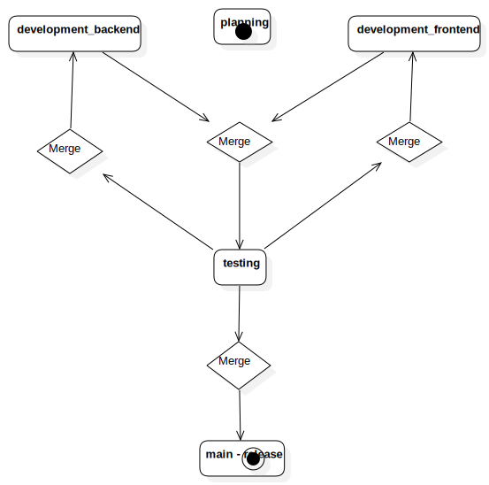
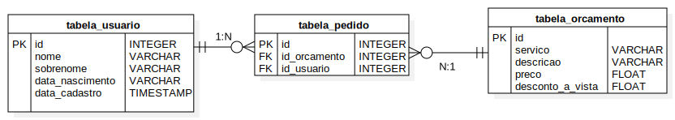

# Nova Vision

## Descrição

- 

Desenvolvimento de um sistema CRUD para solitações de serviços na empresa Nova Vision.

- Visão geral do projeto

- 

## Tecnologias utilizadas

### Arquitetura do projeto

#### Stack de desenvolvimento

- Versionamento
	> Git

- Conteinerização do ambiente de desenvolvimento
	> Docker
    
- Backend/ Sitema de gerenciamento de banco de dados 
	> Java SpringBoot (JPA)

- Frontend
	> HTML e CSS

- Automação da qualidade de software
	> Python

- Gerenciamento do progresso de features
	> Github (Projects section)
    
#### Stack de produção

- Servidor de dados
    - Possibilidade 01
        1. ???

    - Possibilidade 02
        1. ???

- Servidor de hospedagem
    - Possibilidade 01
        1. [Netlify](https://www.netlify.com/).

    - Possibilidade 02
        1. [Vercel](https://vercel.com/).

    - Possibilidade 03
        1. [Byet Host](https://byet.host/).

    - Possibilidade 04
        1. [WebHost](https://www.000webhost.com/).

## Organização do projeto

### Git

- Git branches

|Nome                   |Descrição
|---                    |---
|Main                   |Versão estável do sistema
|development_backend    |Desenvolvimento do backend
|development_frontend   |Desenvolvimento do frontend
|planning               |Esboço do projeto
|testing                |Verificação de erros documentação de features

- Ciclo de vida do desenvolvimento do projeto

- 

### Banco de dados

- 

## Equipe de desenvolvedores

- Quadro de desenvolvedores e suas respectivas responsabilidades

|Membros            |Responsabilidade atribuída
|---                |---
|Guilherme Carini   |Qualidade de software
|Gustavo Scarpim    |Desenvolvimento do frontend
|Henrik Beck        |Desenvolvimento do backend
|Micael Trivelato   |Desenvolvimento do backend
|Victor H. Ranalli  |Engenharia de software
